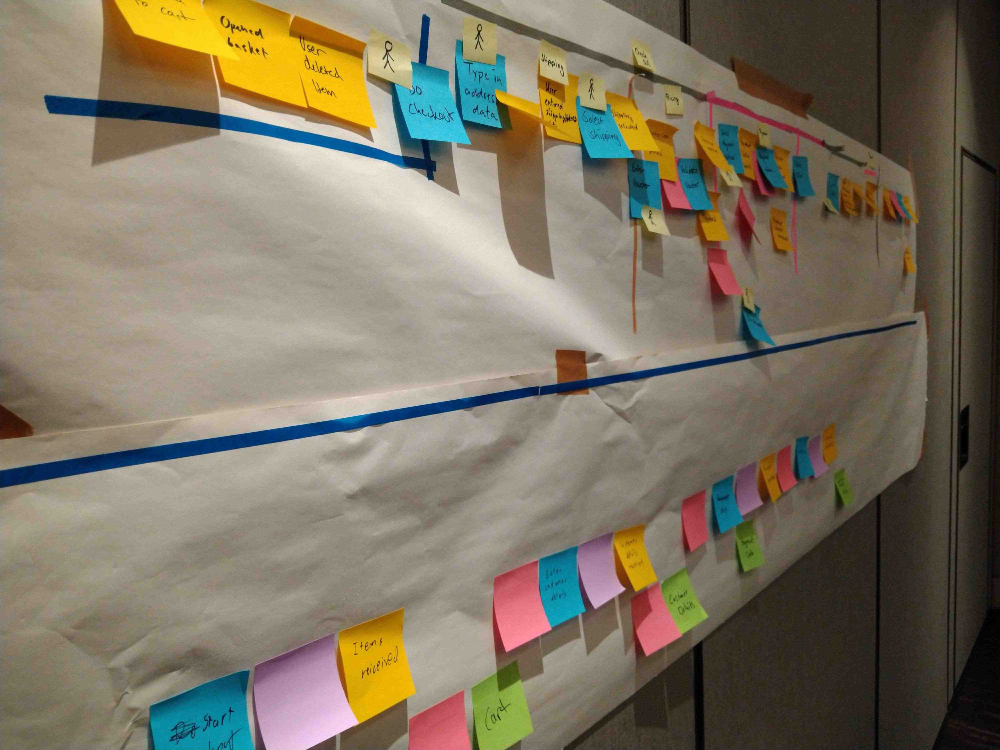

# Event Storming Workshop Material
## IPC 2024 - Munich

This repository contains sample code created during the on-site Workshop at the International PHP Conference (Fall 2024) in Munich. It was written to demonstrate how the result of an event storming session could be applied into code.

---

***The code found in this repository is untested, incomplete and certainly not ready for any type of production use. It is made available for educational purposes only.*** 

---
Copyright (C) 2024 thePHP.cc
